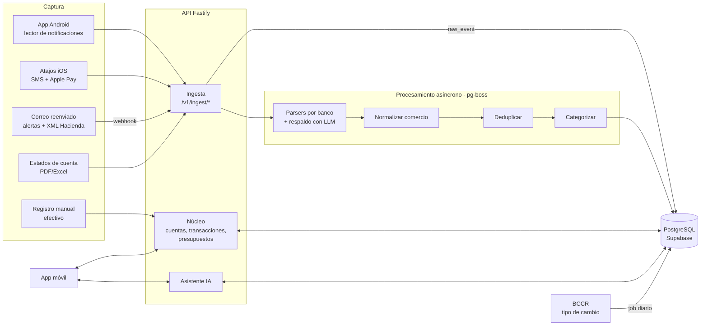
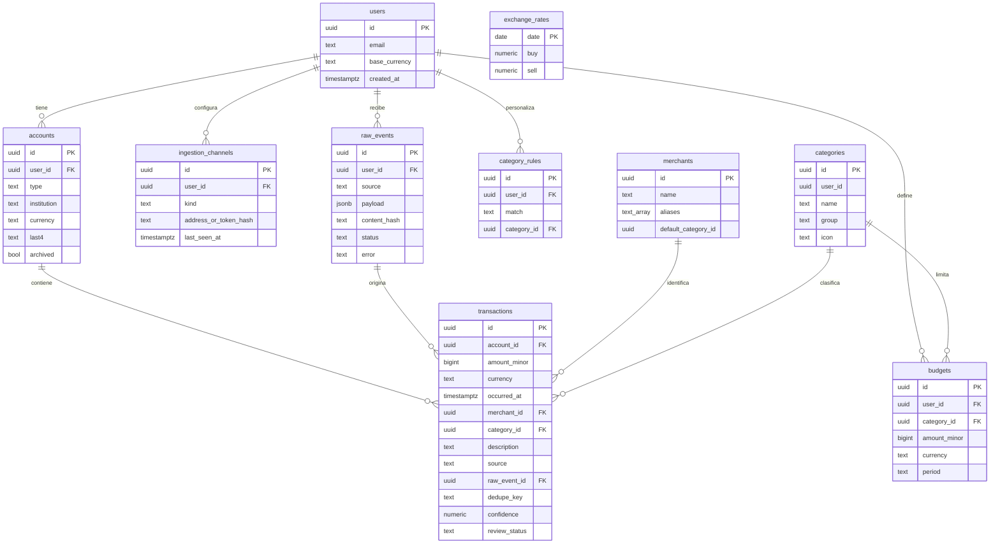

# MoneyTrack — Guía de kickoff y plan de ejecución (equipo de 2)

> **Para qué sirve este documento:** es la guía de la reunión inicial y el plan de trabajo desde cero hasta
> la beta. Está pensado para **dos personas**, con un enfoque lean: pocas reuniones, pocos documentos,
> mucho código que funciona.
>
> Documentos relacionados: [Plan de negocio](plan-de-negocio.md) · [Integraciones](integraciones.md)

---

## 0. Antes de empezar

### 0.1 El proyecto en una frase
MoneyTrack es un **"Monarch Money para Costa Rica"**: una app con IA que junta todo el dinero de una persona
(bancos, SINPE Móvil, tarjetas, efectivo y, más adelante, cripto e inversiones), en colones y dólares.
Como en Costa Rica no hay open banking, los datos se capturan desde **notificaciones, SMS, correo, Apple Pay
y Google Wallet, y estados de cuenta**.

### 0.2 Perfiles (supuesto inicial, se ajusta en la reunión)

| | Persona A | Persona B |
|---|---|---|
| **Enfoque** | Producto + Mobile / Frontend / UX | Backend + Datos / IA + DevOps |
| **Dueño de** | App iOS/Android, captura en el dispositivo (Android nativo y Atajos de iOS), diseño, onboarding | API, base de datos, motor de ingesta y parsers, IA, infraestructura, seguridad |
| **Además** | Voz del usuario: entrevistas, landing, legal y textos | Calidad técnica: CI/CD, monitoreo, costos |

> **Ejercicio en la reunión (15 min):** cada uno se pone una nota del 1 al 5 en: React Native, Kotlin/Android,
> iOS/Atajos, Node/TypeScript, SQL/Postgres, IA/LLMs, DevOps, diseño UI, trato con usuarios.
> Si los resultados contradicen la tabla de arriba, **se intercambian las filas**; el resto del plan sigue igual.

### 0.3 Agenda de la reunión de kickoff (se puede partir en 3 sesiones)

| Sesión | Duración | Contenido | Sale con |
|---|---|---|---|
| **1. Entender** | 3 h | Fase 1: problema, usuarios, alcance del MVP, historias y DoD | `docs/requerimientos.md` |
| **2. Diseñar** | 3 h | Fase 2: stack, arquitectura, modelo de datos, contratos y Git | `docs/arquitectura.md` + ADRs + esquemas |
| **3. Planear y repartir** | 2 h | Fases 3 y 4: tareas, prioridades, reparto y ritmo de trabajo | Tablero con tareas asignadas + repo listo |

**Reglas de la reunión:** decisiones con fecha y dueño; lo que no se decida en 10 minutos va a
"preguntas abiertas" con responsable; nada de diseñar funciones de las fases 4 a 6 del plan de negocio.

---

## Fase 1 — Levantamiento y clarificación de requerimientos

### Objetivo clave
Acordar **qué problema resolvemos, para quién y qué entra en el MVP**, con historias de usuario verificables
y una definición de terminado común.

### Tácticas para aterrizar el problema
1. **Problema en una línea** (5 min): *"Un profesional tico con 2 o más bancos no sabe cuánto tiene ni en qué
   gasta, porque su dinero está repartido y ninguna herramienta lo junta sin open banking."*
2. **Jobs To Be Done** (20 min): completar *"Cuando ___, quiero ___, para ___"* con 5 a 10 frases.
3. **Recorrido del usuario** (30 min): dibujar en una pizarra el día del usuario: cobra → paga con SINPE →
   compra con tarjeta → paga en efectivo → revisa a fin de mes. Marcar dónde MoneyTrack **captura**,
   **ordena** y **aconseja**.
4. **Story mapping** (45 min): actividades en columnas (conectar, ver, entender, planear) e historias debajo.
   Se traza una línea horizontal: arriba queda el MVP y abajo lo que viene después.
5. **Datos reales desde el día 1:** cada persona trae **por lo menos 20 SMS o correos de su banco**, tapados.
   Son los casos de prueba de los parsers, y sin ellos no se puede estimar la captura.
6. **Validación con usuarios:** 5 entrevistas por persona en las 2 semanas siguientes a la reunión.

### Casos de uso del MVP

| # | Caso de uso | ¿MVP? |
|---|---|---|
| CU1 | Crear cuenta y configurar mis cuentas (bancos, tarjetas, efectivo) | ✅ |
| CU2 | Conectar canales de captura (correo, Android, iOS) | ✅ |
| CU3 | Ver mis transacciones capturadas automáticamente, en CRC y USD | ✅ |
| CU4 | Corregir categoría o comercio, y que la app aprenda | ✅ |
| CU5 | Registrar un gasto en efectivo en 5 segundos | ✅ |
| CU6 | Ver el panel del mes: ingresos, gastos, por categoría | ✅ |
| CU7 | Crear presupuestos y recibir alertas | ✅ |
| CU8 | Subir un estado de cuenta para completar o cuadrar | 🟡 Should |
| CU9 | Preguntarle al asistente IA sobre mis gastos | 🟡 Should |
| CU10 | Ver mi patrimonio (activos − deudas) | 🟡 Should |
| CU11 | Conectar billeteras cripto | ⚪ Could |
| CU12 | Brokers, hogar compartido, WhatsApp, Enterprise | ❌ Después del MVP |

### Historias de usuario clave (con criterios de aceptación)

| ID | Historia | Criterios de aceptación |
|---|---|---|
| HU-01 | Como usuario, quiero registrarme con correo y entrar con biometría, para proteger mis datos. | Registro con verificación de correo; Face ID / huella al abrir; sesión que expira. |
| HU-02 | Como usuario, quiero crear mis cuentas (banco, tarjeta, efectivo) en CRC o USD. | Tipo, moneda, banco y últimos 4 dígitos; editar y archivar. |
| HU-03 | Como usuario de Android, quiero que mis SMS y notificaciones bancarias se registren solas. | Permiso explicado; solo se envían mensajes de remitentes financieros; la transacción aparece en menos de 1 minuto. |
| HU-04 | Como usuario de iPhone, quiero instalar un Atajo que envíe mis SMS bancarios y pagos con Apple Pay. | Guía paso a paso; token personal; la transacción aparece en menos de 1 minuto. |
| HU-05 | Como usuario, quiero una dirección de correo propia para reenviar alertas y facturas electrónicas. | La dirección se muestra en la app; se procesan las alertas de los bancos soportados y los XML de Hacienda. |
| HU-06 | Como usuario, quiero que cada movimiento tenga comercio y categoría automáticos. | ≥ 90 % bien categorizados en el conjunto de prueba; un movimiento con confianza baja va a "Por revisar". |
| HU-07 | Como usuario, quiero que la misma compra no aparezca dos veces aunque llegue por SMS y por correo. | Deduplicación por monto, fecha, tarjeta y comercio; opción de deshacer una unión. |
| HU-08 | Como usuario, quiero corregir una categoría y que se aplique a las futuras del mismo comercio. | Pregunta "¿aplicar a futuras?"; se crea una regla por usuario. |
| HU-09 | Como usuario, quiero registrar efectivo en 5 segundos. | Monto → categoría → guardar, en 3 toques o menos. |
| HU-10 | Como usuario, quiero ver mi mes: ingresos, gastos, por categoría y saldo en CRC/USD. | Tipo de cambio del BCCR del día; alternar la moneda principal. |
| HU-11 | Como usuario, quiero presupuestos por categoría con alertas al 80 % y al 100 %. | Notificación push; progreso visible en el panel. |
| HU-12 | Como usuario, quiero subir el PDF de mi estado de cuenta para completar lo que faltó. | Extrae los movimientos; marca duplicados; el usuario confirma antes de guardar. |

### Definition of Done (DoD)
Una tarea está **terminada** solo si:
- [ ] Cumple los criterios de aceptación de su historia
- [ ] Pasó por un **Pull Request revisado por la otra persona**
- [ ] CI en verde: lint, typecheck y pruebas
- [ ] Tiene pruebas: lógica de dinero y parsers con pruebas unitarias; endpoints con al menos una prueba de integración
- [ ] Sin secretos en el código; los datos personales no se guardan en logs
- [ ] Desplegada en **staging** y probada en un teléfono real (si toca la app)
- [ ] Si cambió un contrato de la API, `packages/shared` y la documentación están actualizados

### Métricas de éxito

| Tipo | Métrica | Meta en beta |
|---|---|---|
| Producto | Usuarios que conectan ≥ 1 canal el primer día | > 50 % |
| Producto | % de transacciones capturadas automáticamente | > 80 % |
| Producto | Retención al día 30 | > 25 % |
| Calidad IA | Precisión de extracción (monto, fecha, comercio) | > 98 % |
| Calidad IA | Precisión de categoría | > 90 % |
| Técnica | Tiempo desde el mensaje hasta la transacción visible | < 60 s (p95) |
| Técnica | Crashes | < 1 % de sesiones |
| Negocio | Costo de IA por usuario al mes | < 0,30 USD |

### Preguntas críticas de la Fase 1
1. ¿Con qué **2 bancos** arranca el MVP? (sugerencia: BAC y BCR; BN y Popular en el siguiente ciclo)
2. ¿Android primero, iOS primero o ambos desde el día 1? (sugerencia: ambos, porque el correo funciona en los dos)
3. ¿Qué **no** entra en el MVP? (cripto, brokers, web, WhatsApp y hogar compartido quedan fuera)
4. ¿Dedicación de cada uno: tiempo completo o parcial? ¿Cuántas horas por semana? Esto cambia las fechas.
5. ¿Cuál es la fecha de la beta cerrada y cuántos usuarios de prueba conseguimos?
6. ¿Quién hace la consulta legal (Ley 8968 / PRODHAB)?

### Entregable
📄 **`docs/requerimientos.md`**: problema, casos de uso, historias con criterios de aceptación, DoD, métricas
y preguntas abiertas con dueño. Más la carpeta **`fixtures/`** con los mensajes reales tapados.

### Reparto de la Fase 1

| Actividad | A | B |
|---|---|---|
| Facilitar la reunión y el story mapping | **R** | C |
| Redactar historias y criterios de aceptación | **R** | A (revisa que se puedan construir) |
| Recolectar y anonimizar SMS/correos (corpus) | R (su banco) | R (su banco) + **A** (formato del corpus) |
| Entrevistas con usuarios (5 cada uno) | **R** | R |
| Definir métricas técnicas y DoD | C | **R** |

---

## Fase 2 — Diseño de arquitectura y decisiones técnicas

### Objetivo clave
Elegir un stack que **dos personas puedan operar** sin un equipo de DevOps, definir el modelo de datos y
**los contratos de la API antes de programar**, para que A y B trabajen en paralelo sin bloquearse.

### Stack tecnológico (propuesta justificada)

| Capa | Elección | Por qué |
|---|---|---|
| **Lenguaje** | TypeScript en todo (app, API y tipos compartidos) | Un solo lenguaje; los contratos se comparten con tipos; cualquiera de los dos puede tocar cualquier parte |
| **Mobile** | React Native + **Expo** (dev client, EAS Build) | iOS y Android con una sola base de código; Expo permite agregar código nativo (Kotlin) mediante un *config plugin* para el lector de notificaciones |
| **Módulo nativo Android** | Kotlin (`NotificationListenerService`) | Es la única forma confiable de capturar SMS, apps bancarias y Google Wallet |
| **iOS** | Atajos (Shortcuts) + app | iOS no permite leer SMS; los Atajos de "Mensaje" y "Transacción" llaman a la API |
| **Backend** | Node.js + **Fastify** + **Zod** | Ligero y rápido; Zod valida y genera OpenAPI desde los mismos esquemas |
| **Base de datos** | **PostgreSQL** (Supabase) | Relacional (dinero = consistencia); Supabase incluye Auth, Storage (PDFs) y Row Level Security |
| **Colas / jobs** | **pg-boss** (colas sobre Postgres) | Evita operar Redis; alcanza para el volumen del MVP |
| **Correo entrante** | Postmark Inbound (o Amazon SES) | Convierte cada correo en un webhook JSON; configuración mínima |
| **IA** | API de LLM (p. ej. Claude, de Anthropic): un modelo rápido para extracción y uno más capaz para el asistente | Reglas primero, IA como respaldo, para controlar el costo |
| **Tipo de cambio** | Servicio web de indicadores del BCCR | Fuente oficial en Costa Rica |
| **Hosting API** | Fly.io, Render o Railway (contenedor Docker) | Despliegue con `git push`; barato; región cercana (Miami / EE. UU. Este) |
| **Monitoreo** | Sentry (app + API) + logs estructurados | Gratis o barato al inicio |
| **Web** (después del MVP) | Next.js reutilizando `packages/shared` | No entra en el MVP |

> Cada una de estas decisiones queda como un **ADR** (Architecture Decision Record) de 10 líneas en
> `docs/adr/`: contexto, decisión, alternativas y consecuencias.

### Arquitectura de componentes



**Principio clave:** todo lo que entra se guarda primero **tal cual** en `raw_events` y después se procesa.
Si un parser falla o mejora, se **reprocesa** sin pedirle nada al usuario.

### Modelo de datos inicial



**Reglas de datos no negociables:**
- El dinero se guarda como **entero en la unidad mínima** (`amount_minor`: céntimos) más su `currency`.
  **Nunca usar `float`.**
- Gasto = monto negativo; ingreso = positivo. Las transferencias entre cuentas propias se marcan para que no
  cuenten como gasto.
- Row Level Security en Postgres: cada usuario solo ve sus propias filas.
- `raw_events.content_hash` evita procesar dos veces el mismo mensaje.
- Se agregan después: `goals`, `recurring_series`, `holdings`, `households`.

### Contratos de API (v1)

Los esquemas viven en **`packages/shared`** (Zod), los importan la app y la API, y de ahí se genera OpenAPI.

| Método | Ruta | Quién lo usa | Descripción |
|---|---|---|---|
| POST | `/v1/ingest/notification` | App Android | Notificación o SMS financiero capturado |
| POST | `/v1/ingest/shortcut` | Atajo iOS | SMS o transacción de Apple Pay (autenticación con token personal) |
| POST | `/v1/ingest/email` | Postmark (webhook) | Correo reenviado (firma verificada) |
| POST | `/v1/statements` | App | Subir estado de cuenta (PDF/Excel/CSV) |
| GET/POST/PATCH | `/v1/accounts` | App | Cuentas |
| GET | `/v1/transactions?from&to&account&category&review` | App | Listar y filtrar |
| POST/PATCH | `/v1/transactions` | App | Registro manual o corrección |
| GET | `/v1/summary/month?month=2026-10` | App | Totales del panel |
| GET/POST/PATCH | `/v1/budgets` | App | Presupuestos |
| GET | `/v1/channels` | App | Estado de los canales y la dirección de correo |
| POST | `/v1/assistant/messages` | App | Asistente IA (Should) |

Ejemplo de contrato de ingesta:

```json
POST /v1/ingest/notification
{
  "deviceEventId": "a1b2c3",
  "source": "android_notification",
  "app": "com.android.messaging",
  "sender": "BAC",
  "text": "BAC: Compra aprobada por CRC 12,500.00 en AUTO MERCADO ESCAZU con tarjeta ****1234",
  "receivedAt": "2026-10-03T14:22:05-06:00"
}
→ 202 Accepted { "rawEventId": "..." }
```

La respuesta es `202`: la API guarda el evento y lo procesa en segundo plano. La app **no espera**
al parser.

### Estructura del repositorio (monorepo)

```
moneytrack/
├─ apps/
│  ├─ mobile/            # Expo (React Native) + módulo nativo Android
│  └─ api/               # Fastify + jobs pg-boss
├─ packages/
│  ├─ shared/            # Esquemas Zod, tipos, utilidades de dinero
│  └─ parsers/           # Parsers por banco + pruebas con fixtures
├─ fixtures/             # SMS / correos / XML / PDF tapados (datos de prueba)
├─ supabase/migrations/  # Migraciones SQL
├─ docs/                 # Plan, requerimientos, arquitectura, ADRs
└─ .github/workflows/    # CI/CD
```

### Estrategia de Git (Git Flow simplificado para 2)
- **Una sola rama principal: `main`**, siempre desplegable. Sin rama `develop`.
- Ramas cortas: `feat/…`, `fix/…`, `chore/…`, que duran **1 a 3 días como máximo**.
- **Todo entra por Pull Request** con 1 aprobación de la otra persona y CI en verde. `main` está protegida.
- **Squash merge**, con commits en formato *Conventional Commits* (`feat(api): ingesta de correo`).
- PRs pequeños (**< 400 líneas**); lo que no está listo se esconde detrás de un *feature flag*.
- **Releases:** cada merge a `main` se despliega en staging; un tag `vX.Y.Z` lo lleva a producción y
  dispara el build de la app.
- Urgencias: `hotfix/…` desde `main`, con PR igual (la revisión puede ser posterior si es crítico).

### Preguntas críticas de la Fase 2
1. ¿Supabase (más rápido) o Postgres propio con autenticación propia (más control)?
2. ¿Dónde se aloja la API y en qué región? ¿Hay requisitos de ubicación de los datos?
3. ¿Qué datos **nunca** se envían al LLM? (números completos de tarjeta, cédula, nombres)
4. ¿Cómo se autentica el Atajo de iOS? (token largo por usuario, revocable desde la app)
5. ¿Qué dominio usamos para el correo entrante? (`in.moneytrack.cr` u otro)
6. ¿Presupuesto mensual de infraestructura e IA para el MVP?

### Entregables
- 📐 **`docs/arquitectura.md`**: diagramas de componentes y de datos (esta sección, refinada)
- 📝 **`docs/adr/0001…000N.md`**: una decisión por archivo
- 📦 **`packages/shared`** con los esquemas Zod v1: **el contrato firmado entre A y B**
- 🗄️ Primera migración SQL

### Reparto de la Fase 2

| Actividad | A | B |
|---|---|---|
| Stack mobile y módulo nativo | **R** | C |
| Stack backend, base de datos e infraestructura | C | **R** |
| Modelo de datos | C | **R** |
| Contratos de API (`packages/shared`) | **A** (aprueba que sirvan a la app) | **R** |
| Diagramas y ADRs | R (mobile) | R (backend) |
| Estrategia de Git y reglas del repo | I | **R** |

---

## Fase 3 — Implementación y roadmap

### Objetivo clave
Convertir el MVP en **tareas pequeñas, priorizadas y repartidas** para que ninguno de los dos quede
esperando al otro.

### Cómo se evita el bloqueo entre A y B
1. **Contrato primero:** en la semana 1 se acuerda `packages/shared`. Desde ahí:
   - **A** programa la app contra un **servidor simulado** (fixtures o MSW) que respeta el contrato.
   - **B** prueba la API con los **fixtures reales** y con `curl` o pruebas automáticas, sin necesitar la app.
2. **Integración semanal:** cada viernes se conecta la app real con la API de staging.
3. La captura se divide por la mitad: **A** hace que el dato *salga* del teléfono y **B** hace que el dato
   *se entienda*. El punto de encuentro es `/v1/ingest/*`.

### Hitos (supuesto: ambos a tiempo completo; si es tiempo parcial, multiplicar por ~2)

| Hito | Semanas | Resultado |
|---|---|---|
| **M0 – Fundaciones** | 1–2 | Repo, CI, contratos, diseño de pantallas, corpus de mensajes |
| **M1 – Núcleo** | 3–5 | Registro, cuentas, transacciones manuales, tipo de cambio |
| **M2 – Captura** | 6–9 | Correo, Android, iOS y factura electrónica llegando como transacciones |
| **M3 – Inteligencia** | 10–12 | Categorías, deduplicación, "Por revisar", panel y presupuestos |
| **M4 – Beta** | 13–16 | Estados de cuenta, asistente, seguridad y builds en TestFlight y Play |

### Backlog del MVP (tareas atómicas, MoSCoW)

Tamaño: **S** ≤ 1 día · **M** 2–3 días · **L** 4–5 días. **Dep** = de qué depende.

#### M0 – Fundaciones
| ID | Tarea | MoSCoW | Tam. | Dueño | Dep |
|---|---|---|---|---|---|
| F-01 | Monorepo pnpm + Turborepo, TypeScript estricto | Must | S | B | — |
| F-02 | ESLint, Prettier, Husky, lint-staged y commitlint | Must | S | B | F-01 |
| F-03 | CI en GitHub Actions: lint, typecheck y pruebas | Must | S | B | F-02 |
| F-04 | Supabase dev y prod, primera migración | Must | M | B | F-01 |
| F-05 | Esquemas Zod v1 en `packages/shared` (contratos) | Must | M | B (A aprueba) | — |
| F-06 | App Expo: dev client, navegación, tema y design tokens | Must | M | A | F-01 |
| F-07 | Diseño de flujos y pantallas del MVP (Figma) | Must | L | A | — |
| F-08 | Servidor simulado de la API para la app | Must | S | A | F-05 |
| F-09 | Corpus de ≥ 50 mensajes por banco (BAC y BCR), tapados | Must | M | A + B | — |
| F-10 | Landing con lista de espera | Should | M | A | — |

#### M1 – Núcleo
| ID | Tarea | MoSCoW | Tam. | Dueño | Dep |
|---|---|---|---|---|---|
| N-01 | Autenticación en la API (Supabase Auth, JWT, RLS) | Must | M | B | F-04 |
| N-02 | Pantallas de registro, login y biometría | Must | M | A | F-06 |
| N-03 | Migraciones: accounts, transactions, categories, merchants, raw_events | Must | M | B | F-04 |
| N-04 | API de cuentas (CRUD) | Must | S | B | N-03 |
| N-05 | Pantallas de cuentas | Must | M | A | F-08 |
| N-06 | API de transacciones: listar, filtrar y editar | Must | M | B | N-03 |
| N-07 | Pantallas de lista, detalle y edición de transacciones | Must | L | A | F-08 |
| N-08 | Registro rápido de efectivo (3 toques) | Must | M | A | N-07 |
| N-09 | Job diario del tipo de cambio BCCR + utilidades de dinero CRC/USD | Must | S | B | N-03 |
| N-10 | Categorías por defecto para Costa Rica (seed) | Must | S | A (define) + B (carga) | N-03 |

#### M2 – Captura
| ID | Tarea | MoSCoW | Tam. | Dueño | Dep |
|---|---|---|---|---|---|
| C-01 | Endpoints `/v1/ingest/*` + `raw_events` + cola pg-boss | Must | M | B | N-03 |
| C-02 | Motor de parsers con pruebas basadas en fixtures | Must | M | B | F-09 |
| C-03 | Parsers de BAC y BCR (SMS y correo) | Must | L | B | C-02 |
| C-04 | Módulo nativo Android `NotificationListenerService` (Kotlin + config plugin) | Must | L | A | F-06 |
| C-05 | Filtro en el dispositivo de remitentes financieros + envío con reintentos | Must | M | A | C-04, F-05 |
| C-06 | Atajo iOS "Mensaje" → API, con token personal + guía | Must | M | A | F-05 |
| C-07 | Atajo iOS "Transacción" (Apple Pay) → API | Must | S | A | C-06 |
| C-08 | Correo entrante: dominio, Postmark, dirección por usuario y verificación de firma | Must | M | B | C-01 |
| C-09 | Parser de factura electrónica XML de Hacienda | Should | M | B | C-08 |
| C-10 | Respaldo de extracción con LLM + limpieza de datos personales | Must | M | B | C-02 |
| C-11 | Pantalla "Conectar canales" (onboarding de captura) | Must | M | A | C-06, C-08 |

#### M3 – Inteligencia y valor
| ID | Tarea | MoSCoW | Tam. | Dueño | Dep |
|---|---|---|---|---|---|
| I-01 | Normalización de comercios + diccionario de Costa Rica | Must | M | B (A aporta la lista) | C-03 |
| I-02 | Categorización: reglas → LLM → reglas por usuario | Must | L | B | I-01 |
| I-03 | Deduplicación entre canales + opción de deshacer | Must | M | B | C-03 |
| I-04 | Bandeja "Por revisar" (confianza baja) | Must | M | A | N-07 |
| I-05 | API de resumen mensual (totales y por categoría) | Must | M | B | N-06 |
| I-06 | Panel principal con gráficos | Must | L | A | I-05 |
| I-07 | API de presupuestos + cálculo de avance | Must | M | B | I-05 |
| I-08 | Pantallas de presupuestos | Must | M | A | I-07 |
| I-09 | Notificaciones push: presupuesto al 80/100 % y movimiento nuevo | Should | M | A (app) + B (envío) | I-07 |

#### M4 – Beta
| ID | Tarea | MoSCoW | Tam. | Dueño | Dep |
|---|---|---|---|---|---|
| B-01 | Estados de cuenta: subida + extracción con IA + confirmación | Should | L | B | C-10 |
| B-02 | Pantalla de subida y revisión de estado de cuenta | Should | S | A | B-01 |
| B-03 | Asistente IA (herramientas que consultan los datos del usuario) | Should | L | B | I-05 |
| B-04 | Pantalla de chat del asistente | Should | M | A | B-03 |
| B-05 | Patrimonio: API + pantalla | Should | M | B + A | N-04 |
| B-06 | Seguridad: rate limiting, rotación de tokens, revisión de RLS, borrado de cuenta | Must | M | B | — |
| B-07 | Sentry en la app y la API, logs sin datos personales | Must | S | A + B | — |
| B-08 | Builds EAS, TestFlight y prueba interna de Play (incluido el formulario de permiso de notificaciones) | Must | M | A | C-04 |
| B-09 | Política de privacidad, términos y consulta legal | Must | M | A | — |

#### Fuera del MVP
| MoSCoW | Qué |
|---|---|
| **Could** | Billeteras cripto de solo lectura · app web · parsers de BN y Popular · modo oscuro |
| **Won't (por ahora)** | Brokers · hogar compartido · WhatsApp · OAuth de Gmail/Outlook · Enterprise · alianzas bancarias |

**Balance de carga:** A tiene unas 25 tareas, con el peso en la app y la captura en el dispositivo. B tiene unas 29,
con el peso en la API, los parsers y la IA (algunas son compartidas). Las tareas **L** quedan 4 y 4. Si alguno se
atrasa, las tareas **Should** son lo primero que se mueve de hito.

### Setup de entorno local
Objetivo: **clonar y levantar todo en menos de 15 minutos** con un solo `README`.

```bash
git clone … && cd moneytrack
pnpm install
cp .env.example .env            # nunca se sube .env
supabase start                  # Postgres + Auth locales (Docker)
pnpm db:migrate && pnpm db:seed
pnpm dev                        # API en :3000 + Expo
pnpm test                       # pruebas unitarias + parsers con fixtures
```

- Node LTS fijado con `.nvmrc`; pnpm fijado en `packageManager`.
- `.env.example` documentado; los secretos reales van en el gestor de secretos del hosting y de GitHub.
- Script `pnpm ingest:fake` que envía mensajes de `fixtures/` a la API local, para probar el flujo completo sin teléfono.

### CI/CD básico (GitHub Actions)

| Disparador | Qué corre |
|---|---|
| Cada PR | Instalar → lint → typecheck → pruebas unitarias → pruebas de parsers con fixtures |
| Merge a `main` | Todo lo anterior → migraciones en staging → despliegue de la API en staging |
| Tag `vX.Y.Z` | Despliegue de la API en producción → build EAS → subida a TestFlight y Play (prueba interna) |

### Estándares de código
- **TypeScript `strict`**, sin `any` salvo que se justifique con un comentario.
- **ESLint + Prettier** automáticos antes de cada commit (Husky + lint-staged).
- **Conventional Commits** validados con commitlint.
- Dinero: siempre con las utilidades de `packages/shared/money` (enteros); prohibido operar montos con `float`.
- Cada parser nuevo necesita **fixtures y pruebas** antes de pasar a merge.
- Kotlin (módulo Android) con ktlint.

### Preguntas críticas de la Fase 3
1. ¿Las fechas de los hitos son realistas con la dedicación real de cada uno?
2. ¿Qué se corta primero si vamos atrasados? (propuesta: C-09, B-03 y B-05)
3. ¿Cuántos usuarios de beta necesitamos y quién los consigue?
4. ¿Qué herramienta de tablero usamos? (propuesta: GitHub Projects, porque ya estamos en GitHub)

### Entregables
- 🗂️ Tablero de **GitHub Projects** con todas las tareas de arriba, con hito, tamaño y dueño
- 🧱 Repositorio con M0 terminado: monorepo, CI en verde, contratos y app y API "hola mundo" desplegadas

---

## Fase 4 — Matriz de reparto de carga y dinámica de trabajo

### Objetivo clave
Que cada entregable tenga **un solo responsable**, que **la otra persona siempre revise** y que el ritmo
de trabajo sea liviano pero constante.

### Matriz RACI
**R** = lo hace · **A** = aprueba (revisa y da el visto bueno) · **C** = se le consulta · **I** = se le informa

| Entregable / área | Persona A | Persona B |
|---|---|---|
| Requerimientos, historias y priorización | R/A | C |
| Diseño UX/UI y textos de la app | R/A | C |
| Contratos de API (`packages/shared`) | A | R |
| Modelo de datos y migraciones | C | R/A |
| Monorepo, CI/CD y estándares | I | R/A |
| Infraestructura, hosting y secretos | I | R/A |
| App mobile (pantallas y navegación) | R | A |
| Módulo nativo Android (notificaciones) | R | A |
| Atajos iOS y su guía | R | A |
| Endpoints de ingesta y colas | A | R |
| Parsers por banco | C | R |
| Corpus de fixtures | R | R/A |
| Correo entrante y factura electrónica | I | R/A |
| IA: extracción, categorización y deduplicación | C | R/A |
| Asistente IA (lógica) | C | R/A |
| Asistente IA (experiencia en la app) | R/A | C |
| Panel, presupuestos y alertas | R (app) | R (API) / A cruzado |
| Seguridad, privacidad técnica y RLS | A | R |
| Legal, privacidad y términos | R/A | C |
| Publicación en App Store y Google Play | R/A | I |
| Entrevistas y beta con usuarios | R/A | R |
| Monitoreo y respuesta a incidentes | C | R/A |

> **Regla anti-cuello de botella:** ninguno puede ser el único que entiende una pieza crítica.
> Una vez por hito, cada uno hace **una tarea pequeña del lado del otro** (por ejemplo, A escribe un parser y
> B una pantalla simple).

### Ritmo de trabajo

| Ritual | Cuándo | Duración | Formato |
|---|---|---|---|
| **Standup asíncrono** | Diario, antes de las 10 a. m. | 2 min | Mensaje en el chat: *Ayer · Hoy · Bloqueos* |
| **Standup en vivo** | Lunes y jueves | 15 min | Solo bloqueos y dependencias; nada de detalles técnicos largos |
| **Planificación semanal** | Lunes | 30–45 min | Elegir las tareas de la semana en el tablero y revisar dependencias |
| **Demo + integración** | Viernes | 45 min | Probar la app real contra staging en teléfonos reales |
| **Retro** | Viernes (cada 2 semanas) | 15 min | ¿Qué funcionó? ¿Qué cambiamos? Máximo 1 o 2 acciones |

**Regla de bloqueos:** si alguien está bloqueado más de **2 horas**, avisa de inmediato y cambia a otra tarea
del tablero mientras se resuelve.

### Protocolo de revisión cruzada (peer review)
1. **Tamaño:** PR de menos de 400 líneas, con una descripción que diga qué hace, cómo probarlo y capturas si toca la app.
2. **Tiempos:** revisión en menos de **4 horas hábiles** (máximo 24 h). Revisar tiene prioridad sobre empezar algo nuevo.
3. **Checklist del revisor:**
   - [ ] ¿Cumple los criterios de aceptación?
   - [ ] ¿Hay pruebas? ¿La lógica de dinero usa enteros?
   - [ ] ¿Se registran datos personales en logs o se envían al LLM sin necesidad?
   - [ ] ¿Cambió el contrato? ¿Se actualizó `packages/shared`?
   - [ ] ¿Se entiende sin que el autor lo explique?
4. **Comentarios:** prefijo `bloqueante:`, `sugerencia:` o `pregunta:`. Solo los bloqueantes detienen el merge.
5. **Pair programming obligatorio (30–60 min)** en: autenticación, deduplicación, cálculo de dinero,
   seguridad y todo lo que toque la privacidad del usuario.
6. Si hay desacuerdo técnico sin solución en 15 minutos: se escribe un ADR corto y decide el **dueño (R)** del área.

### Preguntas críticas de la Fase 4
1. ¿El resultado del ejercicio de habilidades confirma el reparto A/B o hay que intercambiar áreas?
2. ¿Qué horario se cruza entre los dos para los standups en vivo y el pair programming?
3. ¿Qué canal usamos para el día a día? (WhatsApp, Slack o Discord)
4. ¿Cómo tomamos decisiones de producto si no estamos de acuerdo? (propuesta: decide A, informado por datos de usuarios)

### Entregables
- 📋 La matriz RACI de arriba, confirmada y fijada en el `README`
- 📆 Calendario con los rituales
- ✅ `CONTRIBUTING.md` con el flujo de Git, el checklist de PR y la Definition of Done

---

## Checklist de salida del kickoff

- [ ] Problema, casos de uso e historias del MVP acordados (`docs/requerimientos.md`)
- [ ] Bancos del MVP elegidos y corpus de mensajes en camino
- [ ] Stack aprobado y ADRs escritos
- [ ] Modelo de datos y contratos v1 en `packages/shared`
- [ ] Tablero con las tareas de M0 y M1 asignadas
- [ ] Reparto A/B confirmado con el ejercicio de habilidades
- [ ] Rituales en el calendario
- [ ] Fecha objetivo de la beta cerrada
